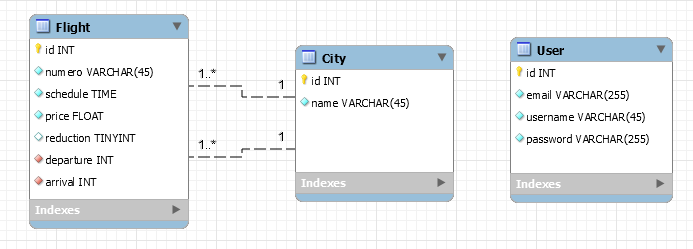

# Analyse génarale du projet

Un cie de vols privés propose des trajets VIP vers des capitales européennes.
Une application avec :

- un système de login avec deux type de user ( USER, ADMIN)
- Un espace privé qui affiche les vols et propose des actions pour :
  - créer un nouveau vol
  - modifier un vol
  - voir un vol
  - Supprimer un vol

L'application à ce stade permet de gérer les vols de la journée courante.

# Analyse fonctionnelle

- A faire par mes chers élèves.
- Compréhensible par le client
- Peut donner lieu à un Use case UML

# couche métier

- dégager les types de données
- Ici :
  1. Vol || trajet
  2. Capitale
  3. User

## Modélisation base de données

- Un diagramme de classe UML basé sur l'analyse fonctionnelle.
- Nous ici, on va créer un diagramme MySQLWB.
  

# Configuration de l'application

1. database
2. Les entités Flight et City et leur relation
   > ne pas faire User
3. Les fixtures

- Créer un tableau d'objets du type City

- Créer un ou 2 vols
  > numero de vol statique exp: AH2349

**NB** : Eviter le copier/coller de code.
